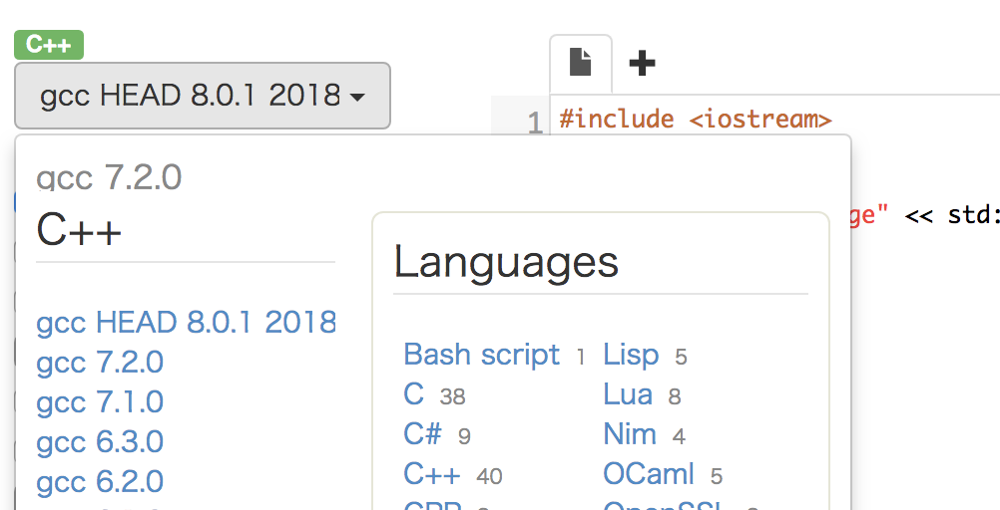

<!-- $theme: default -->

# C++講座(入門編)
#### nito(c|k)::ict::kurokoji
###### 2018/3/19

---
<!-- page_number: true -->

## C++とは

- Cにclassとかが生えたやつ
- STL(Standard Template Library)

---

## C++の規格

- C++98
- C++03
- C++11
- C++14
- C++17(now)

今回の講座では基本的にC++11以上を想定

---

## コンパイラ

- bcc(古いので使わないで😅)
- gcc
- clang(llvm)
- VC++

---
## 本講座実行環境

- [Wandbox](https://wandbox.org/)
  - 左上からC++を選択する
  - gcc HEAD ~ を選択する(最新を使ってほしい)
  - コード書くところにコードを書く
  
  - `stdin`の欄に標準入力に与えるパラメータを書く
  - `Run`で実行
---


# C++とCを比べる

--- 
## Hello, World!!のプログラム
``` cpp
// Main.cpp
#include <iostream>
#include <cstdio>
using namespace std; // 今はおまじないとしておきます

int main() {
  cout << "Hello, World!!" << endl;
  printf("Hello, World!!"); // こっちでも良い
}
```
``` c
// Main.c
#include <stdio.h>

int main(void) {
  printf("Hello, World!!\n");
  return 0;
}
```

---

## Hello, World!!のプログラム

- 拡張子が違う
  - Cでは`.c`
  - C++では`.cpp`

- C++でもCのlibraryは使える
  - Cのlibraryを扱うときは`.h`を抜いて先頭に`c`を付ける
    - Cでは`#include <stdio.h>`
    - C++では`#include <cstdio>`
     (`#include <stdio.h>`でも動くのでどっちでも良い)
- 関数の`void`は省略出来る
- `main`の`return 0;`は省略出来る
  - C++では仕様で`0`が返る

--- 

## 構造体

``` 
// C++
struct Shinobu {
  int height;
  double weight;
};

int main() {
  Shinobu st;
  st.height = 154;
  st.weight = 41;
}
```

``` c
// C
typedef struct {
  int height;
  double weight;
} Shinobu;
// mainは同じ
```

---

# CにないC++の機能

---

## `bool`型

``` cpp
bool is_leep(int y) {
  bool res = (y % 400 == 0) || (y % 4 == 0 && y % 100 != 0);
  return res;
}
```


---

``` cpp
bool res;
int a = 1, b = 2;
res = true; // 数値的には1
res = false; // 数値的には0

if (res) {
  cout << "true" << endl;
} else {
  cout << "false" << endl;
}

res = a < b; // true
res = a > b; // false
// 否定演算子(!) !trueはfalse, !falseはtrue
res = !res;
```
---

- フラグ管理に使う
  - フラグであることが分かりやすい

  ``` cpp
  int flg;
  bool flg;
  ```
  ``` cpp
  flg = 1;
  flg = true;
  ```
  - また，ビット演算子`|`, `&`, `^`, `~`も使える
  ``` cpp
  res = ~((a | b) & (a ^ b));
  ```
- 真か偽を判定するには1と0で十分
  - `int`型は4byte(もったいない)
  - `bool`型は1byteなのでメモリを節約できる

---


## 自由な変数宣言位置

``` c
// C
int main(void) {
  int n, m;
  int i;
  int t;
  int sum1 = 0, sum2 = 0;
  
  scanf("%d%d", &n, &m);
  for (i = 0; i < n; ++i) {
    scanf("%d", &t);
    sum1 += t;
  }
  
  for (i = 0; i < m; ++i) {
    scanf("%d", &t);
    sum2 += t;
  }
}
```

---

``` cpp
// C++
int main() {
  int n, m;
  scanf("%d", &n, &m);
  
  int sum1 = 0; 
  for (int i = 0; i < n; ++i) {
    int t;
    scanf("%d", &t);
    sum1 += t;
  }
  
  int sum2 = 0;
  for (int i = 0; i < m; ++i) {
    int t;
    scanf("%d", &t);
    sum2 += t;
  }
}
```

---

- C++の場合，宣言がどこでもできる
  - `for (int i = 0; i < n; ++i)`のように`for`の中でも
    宣言できる
  - スコープ(関数や変数の見える範囲)は**宣言したところ**から
    その**ブロック({})の最後**まで

---


<div style="text-align: center;">どのように動作するか実行してみましょう</div>

``` cpp
#include <iostream>
using namespace std;

int t = 1;
int main() {
  cout << t << endl;
  int t = 2;
  if (true) {
    int t = 3;
    cout << t << endl;
  }
  cout << t << endl;
}
```

---


```
1
3
2
```
のように表示されるはず

---

`::`スコープ解決演算子を変数名の前に付けることで，どんなスコープグローバル変数を参照することができる
``` cpp
cout << ::t << endl;
```

---

## auto(>= C++11)

``` cpp
int main() {
  auto n = 1; // nはint型
  auto d = ""; // const char*型
}
```
---

- 変数宣言時に`auto`を使うことで勝手に型を推論してくれる
- 後に説明するが，型名が長い場合`auto`を使ったほうが綺麗に見える場合が多い
---

# STL(Standard Template Library)

---

## STL(Standard Template Library)とは

- C++に標準で実装されている便利なやつら
- `template` という機能で実装されている(後述)
  - コンテナ(データ構造)，アルゴリズム，イテレータ...
- 便利なものやこれいる?みたいなものまで多種多様


---
## そのまえに

- コード中に`cout`, `endl`, `cin`が出て来るがこれらはC++の標準入出力
- `#include <iostream>`をすると使える
- `cin`は入力
  - `>>`演算子を繋げて空白，改行区切りに読み込むことが出来る
- `cout`は出力
  - `<<`演算子を繋げて変数や数字，文字列を繋げて出力
  - `endl`は改行+バッファフラッシュ(ここでは`\n`)で代用可
  ``` cpp
  #include <iostream>
  using namespace std;

  int main() {
    int a, b, c;
    cin >> a >> b >> c;
    cout << a << " " << b << " " << c << endl;
    cout << a << " " << b << " " << c << `\n`; // これでもOK
  }
  ```

---

## string

- 可変長な文字列(長さをプログラム中で動的に変えられる)
- 今までは`char[要素数] s`のように事前に要素数を決める必要があった
- `#include <string>`をすると使える
- `[]`演算子で1文字ずつアクセスできる


---

``` cpp
#include <iostream>
#include <string>
using namespace std;

int main() {
  string s, t;
  cin >> s >> t;
  cout << s << endl;
  printf("%s\n", s.c_str()); // char[]が返る
  string tmp = s; // 代入
  s += t; // 連結 s = s + tと同じ
  s += "hoge";
  // ==で同じ文字列であるか比較
  // <, <=, >, >=も使える(辞書順的にどちらが小さいか)
  if (s == "poyoyohoge") {
    cout << "same" << endl;
  } else {
    cout << "different" << endl;
  }
  cout << s << endl;
}
```
---

## vector\<T\>

- 可変長な配列
- `#include <vector>`をすると使える
- 各要素に配列に`[]`演算子でアクセスできる $O(1)$
- 末尾に要素を追加する
  `push_back`, `emplace_back`(>= C++11) $O(1)$
  
---

``` cpp
#include <iostream>
#include <vector>
using namespace std;

int main() {
  int n;
  vector<int> v;
  cin >> n;
  for (int i = 0; i < n; ++i) {
    int tmp;
    cin >> tmp;
    v.push_back(tmp);
  }
  for (int i = 0; i < n; ++i) {
    cout << v[i] << endl;
  }
}
```

---

## sort(a, b), stable_sort(a, b)

- 配列をソートする関数(デフォルトでは昇順)
- aからb-1の範囲をソートする
- `#include <algorithm>`をすると使える
- quicksortをベースに作られている(不安定ソート)
- mergesortをベースに作られている`stable_sort`(安定ソート)
  もある
  
---

``` cpp
#include <iostream>
#include <vector>
#include <algorithm>
using namespace std;

int main() {
  int a[5] = {5, 10, 1, 32, 12};
  sort(a, a + 10); // sort(配列名, 配列名+長さ)
  for (int i = 0; i < 10; ++i) {
    cout << a[i] << endl; 
  }
  // vectorでも使える
  vector<int> v;
  int n;
  for (int i = 0; i < n; ++i) {
    int tmp;
    cin >> tmp;
    v.push_back(tmp);
  }
  sort(v.begin(), v.end());
  // sort(begin(v), end(v)); でもOK
  for (int i = 0; i < v.size(); ++i) {
    cout << v[i] << endl;
  }
}
```

---
## reverse(a, b)

- 配列をひっくり返す
- aからb-1の範囲をひっくり返す
- `#include <algorithm>`をすると使える

---
``` cpp
#include <iostream>
#include <algorithm>
using namespace std;

int main() {
  char s[7] = "ubonihs";
  reverse(s, s + 7); // reverse(配列名, 配列名+長さ)
  // 当然vectorでも使えます
  vector<int> v;
  // 入力
  reverse(v.begin(), v.end());
}
```

---

## max(a, b), min(a, b)

- それぞれ，与えられた2つの引数の大きい，小さいほうを返す
- a, bの大きいほう，小さい方
- `#include <algorithm>`をすると使える
- 与えられる引数は双方ともに同じ型でなければならない

---

``` cpp
#include <iostream>
#include <algorithm>
using namespace std;

int main() {
  int a = 2, b = 3;
  cout << max(a, b) << endl;
  cout << min(a, b) << endl;
}
```
---

## swap(a, b)

- 2つの引数を与えたときその値を交換する
- a, bを交換
- `#include <algorithm>`をすると使える

---

``` cpp
#include <iostream>
#include <algorithm>
using namespace std;

int main() {
  int a = 4, b = 10;
  swap(a, b);
  cout << a << " " << b << endl;
  swap(a, b);
  cout << a << " " << b << endl;
}
```

---

## fill(a, b, n)

- 配列をある要素で埋める
- a, b - 1の範囲をnで埋める
- `#include <algorithm>`をすると使える

---

``` cpp
#include <iostream>
#include <algorithm>
using namespace std;

int main() {
  int a[] = {1, 2, 3, 4, 1};
  fill(a, a + 5, 5);
  for (int i = 0; i < 5; ++i) {
    cout << a[i] << endl;
  }
}
```
---
## count(a, b, n)

- 配列の中である要素と一致した数を返す
- a, b - 1の範囲でnと一致した数を返す
- `#include <algorithm>`をすると使える

---

``` cpp
#include <iostream>
#include <algorithm>
using namespace std;

int main() {
  int a[] = {1, 2, 3, 1, 1, 1};
  cout << count(a, a + 6, 1) << endl;
}
```
---

## find(a, b, n)

- 配列の中である要素が存在するか，存在したなら
  そのポインタを返し，存在しないなら末尾ポインタを返す
- a, b - 1の範囲でnが見つかればそのポインタを返し，
  見つからなければbを返す
- `#include <algorithm>`をすると使える

---

``` cpp
#include <iostraem>
#include <algorithm>
using namespace std;

int main() {
  int a[] = {1, 2, 3, 4};
  if (find(a, a + 4, 4) == a + 4) {
    cout << "not found" << endl;
  } else {
    cout << "found" << endl;
  }
}
```

---

## ほかにも色々
- `remove`, `for_each`, `unique`, `next_permutaion`, `merge`
- `set<T>`, `map<T>`, `bitset`...

本当に多いので気になるものは自分で調べる

---

## 課題

- 入力された文字列を辞書順(降順)にソートしてみよう
  - `ab`と`ac`を比較したとき文字コード的に小さいのは`ab`
- ただし`string`, `vector`, `sort`を必ず使用すること

---

## 別名をつける

- `typedef`
  ``` cpp
  typedef int score;
  // typedef 元の型名 別名;
  ```
- `using`(>= C++11)
  ``` cpp
  using score = int;
  // using 別名 = 元の型名;
  ```